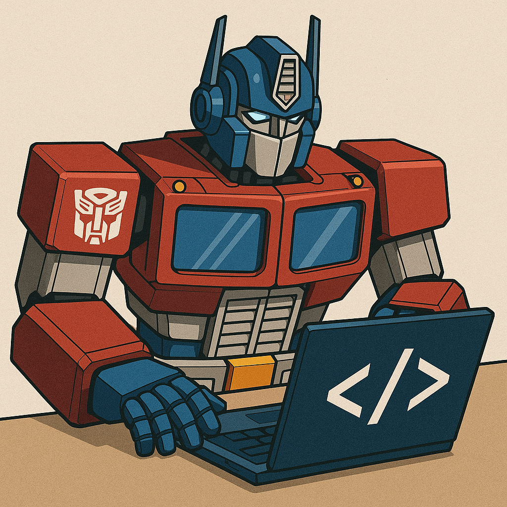
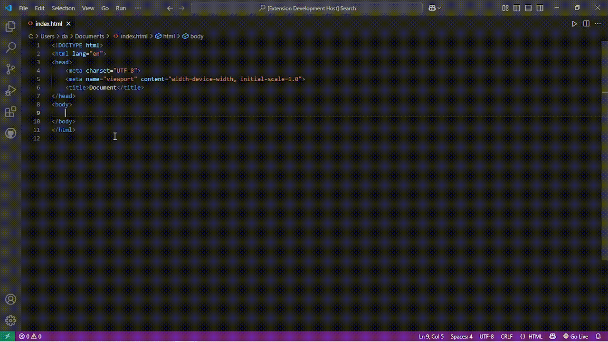

# 🚗 op-ipsum

Welcome to **op-ipsum** – the VS Code extension that transforms your editor into a battleground of wit, wisdom, and robot banter! Why settle for boring placeholder text when you can have Optimus Prime, Bumblebee, and Megatron dropping quotes hotter than a Decepticon’s exhaust?

---

## 🤖 Why Was This Created?

Because Lorem Ipsum is for mere mortals.  
You deserve code filled with the heroic speeches of Optimus, the sass of Bumblebee, and the villainous monologues of Megatron.  
Whether you’re debugging at dawn or just need a laugh, op-ipsum brings the Transformers universe right into your codebase.

---

## 🚀 How Does It Work?

1. **Type a magic keyword** in your HTML file:
   - `optimus`
   - `bumble`
   - `mega`
   - `olg`
   - `blg`
   - `mlg`

2. **Trigger the suggestion**  
   - Just finish typing the keyword, and a random quote suggestion will appear.
   - If it doesn’t, hit <kbd>Ctrl</kbd>+<kbd>Space</kbd> (because even Autobots need a little push sometimes).

3. **Accept the suggestion**  
   - The keyword will be replaced by a random, hilarious, or epic quote from your favorite bot.

---

## ✨ Example

Type this in your HTML file:

Then accept the suggestion, and watch Optimus Prime drop some wisdom right into your code.

---

## 🛠️ Requirements

- Visual Studio Code 1.100.0 or higher
- A sense of humor

---

## 📝 Supported Keywords

| Keyword   | Who’s Talking?      |
|-----------|---------------------|
| optimus   | Optimus Prime       |
| bumble    | Bumblebee           |
| mega      | Megatron            |
| olg       | Old-school Optimus  |
| blg       | Bumblebee Lore      |
| mlg       | Megatron Lore       |

---

## 😅 Why Should You Use This?

- Because your code reviews are too quiet.
- Because Lorem Ipsum never saved Cybertron.
- Because you want to see your teammates ask, “Why is Megatron in our HTML?”

---

## 🐞 Known Issues

- May cause spontaneous robot impressions in the office.
- If you type a keyword and nothing happens, try <kbd>Ctrl</kbd>+<kbd>Space</kbd> or check for typos (even robots make mistakes).

---

## 📦 Release Notes

- 1.0.0: Autobots, roll out! First release with all the banter you can handle.

---

**Install, type, and let the robots do the talking!**

*“Freedom is the right of all sentient beings – and so is good placeholder text.”*  
— Optimus Prime (probably)